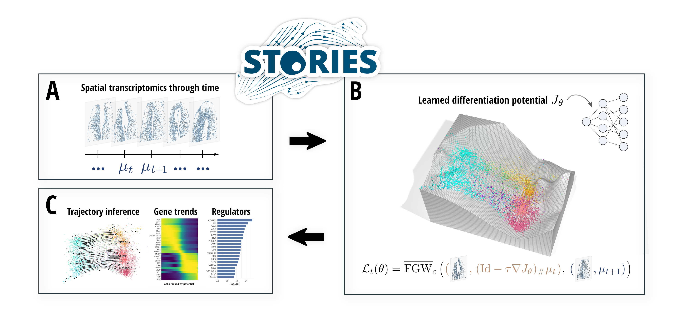

# Learning cell fate landscapes from spatial transcriptomics using Fused Gromov-Wasserstein

[](https://codecov.io/gh/cantinilab/stories)
[](https://github.com/cantinilab/stories/actions/workflows/main.yml)
[](https://github.com/psf/black)
[](https://stories.readthedocs.io/en/latest/?badge=latest)
[](https://img.shields.io/pypi/v/stories-jax?color=blue)

STORIES is a trajectory inference method capable of learning a causal model of cellular differentiation from spatial transcriptomics through time using Fused Gromov-Wasserstein. STORIES learns a potential function that defines each cell's stage of differentiation and allows one to predict the evolution of cells at future time points. In addition, STORIES uncovers possible driver genes and transcriptional regulators of cellular differentiation.

[Read the preprint here](https://www.biorxiv.org/content/10.1101/2024.07.26.605241v1) and [the documentation here](https://stories.rtfd.io)!

STORIES is based on the Scverse ecosystem, making it easy to interface with existing tools for single-cell analysis such as Scanpy and CellRank. In addition, STORIES benefits from the JAX ecosystem for deep learning and OT computation, enabling the fast handling of large datasets.



## Install the package

- STORIES is implemented as a Python package seamlessly integrated within the scverse ecosystem. It relies on JAX for fast GPU computations and JIT compilation, and OTT for Optimal Transport computations.
- **System requirements**: Python >= 3.10. Continuously tested on Ubuntu 22.04 LTS. Installation time <1mn. Benefits from CUDA or TPU for large datasets (on a GPU A40 and for 800k cells, training time ~ 30mn).

### via PyPI (recommended)

```bash
pip install stories-jax
```

By default, JAX is installed for CPU. To get the GPU version, you can use the following (refer to [JAX's docs](https://jax.readthedocs.io/en/latest/installation.html)). For use in Google Colab, you'll need to restart the kernel after this command.

```bash
pip install stories-jax jax[cuda12]
```

### via GitHub (development version)

```bash
git clone git@github.com:cantinilab/stories.git
pip install ./stories/
```

## Getting started

STORIES takes as an input an AnnData object, where omics information and spatial coordinates are stored in `obsm`, and `obs` contains time information, and optionally a proliferation weight. Visit the **Getting started** and **API** sections for tutorials and documentation.
