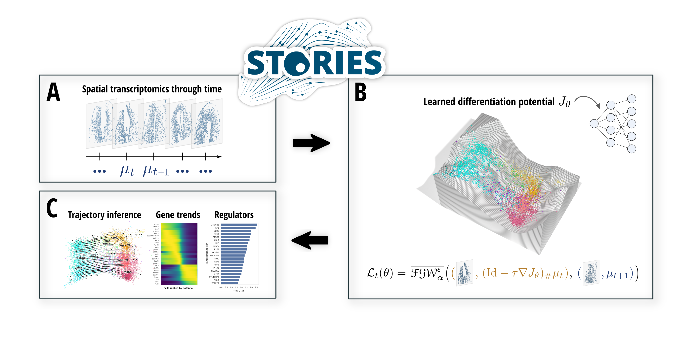

# Learning cell fate landscapes from spatial transcriptomics using Fused Gromov-Wasserstein

[](https://codecov.io/gh/gjhuizing/stories)

STORIES is a novel trajectory inference method for spatial transcriptomics data profiled at several time points, relying on Wasserstein gradient flow learning and Fused Gromov-Wasserstein. [Read the preprint here](https://www.biorxiv.org/content/xxxxx) and [the documentation here](https://stories.rtfd.io)!



## Install the package

STORIES is implemented as a Python package seamlessly integrated within the scverse ecosystem. It relies on JAX for fast GPU computations and JIT compilation, and OTT for Optimal Transport computations.

### via PyPI (recommended)

```bash
pip install stories-jax
```

### via GitHub (development version)

```bash
git clone git@github.com:cantinilab/stories.git
pip install ./stories/
```

## Getting started

STORIES takes as an input an AnnData object, where omics information and spatial coordinates are stored in `obsm`, and `obs` contains time information, and optionally a proliferation weight. Visit the **Getting started** and **API** sections for tutorials and documentation.
